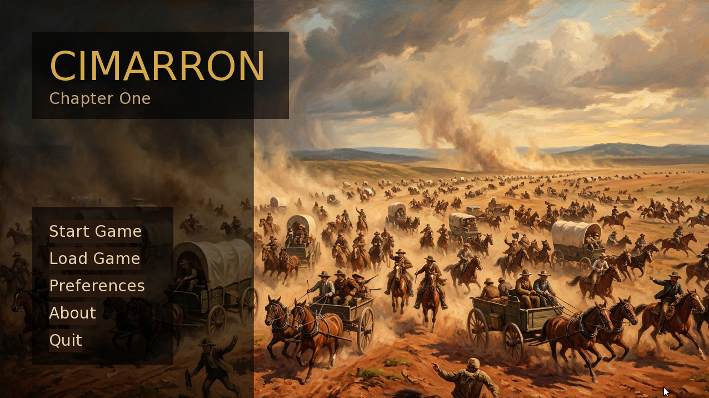

# Cimarron

A visual novel adaptation of *Cimarron* by Edna Ferber (1929), built in Ren'Py.



You play as **Sabra Cravat** — a refined Southern belle pulled into frontier life
by her charismatic husband Yancey. Chapter One follows the family from a Sunday
dinner in Wichita, Kansas, through the Oklahoma Land Run of 1889, to the founding
of the boom town of Osage.

---

## Quick Start

1. **Download Ren'Py** (free) from https://www.renpy.org/
2. Open the Ren'Py launcher → **Open Project** → select `cimarron_chapter1/`
3. Click **Launch Project**

---

## Repository Layout

```
cimarron/
├── book.md               ← Source text: Cimarron by Edna Ferber (public domain)
├── PLAN.md               ← Design document and scene breakdown
├── LICENSE               ← MIT license (game code) + public domain note (source text)
└── cimarron_chapter1/    ← Ren'Py game project
    ├── README.md         ← Full asset guide, mechanics reference, scene list
    └── game/
        ├── script.rpy                ← All 7 scenes, dialogue, and choices
        ├── characters.rpy            ← Character definitions
        ├── variables.rpy             ← Game state variables
        ├── options.rpy               ← Project configuration
        ├── gui.rpy                   ← Visual theme (earth tones, fonts)
        ├── screens.rpy               ← UI screens (save/load, menus)
        ├── minigame_typesetting.rpy  ← Scene 6 typesetting mini-game
        ├── images/                   ← Backgrounds and sprites (add your art here)
        └── audio/                    ← Music tracks (add .ogg files here)
```

See **`cimarron_chapter1/README.md`** for the full asset guide, font setup,
mechanics reference, and scene breakdown.

---

## Chapter One — What's in the Game

**7 scenes** covering Wichita through the founding of Osage:

1. The Venable Home — Yancey arrives and recounts the Land Run
2. The Land Run Flashback — the woman on the black thoroughbred
3. The Decision — Sabra chooses to go west against her mother's will
4. The Journey West — nine days across the red clay of Oklahoma
5. Arriving at Osage — culture shock and first frontier encounters
6. The Oklahoma Wigwam — setting up the press; typesetting mini-game
7. End of Chapter — church in a saloon; Sabra writes home

**~18 choice moments** that shape two tracked values:

| Meter | Range | Effect |
|---|---|---|
| Yancey Relationship | 0 – 100 | Dialogue warmth; end-of-chapter summary |
| Sabra's Direction | negative ↔ positive | Refined Lady vs. Frontier Woman track |

**Typesetting mini-game** in Scene 6: arrange five scrambled lead-type tiles to
spell **OSAGE** in the composing stick. Getting it right earns Yancey's respect
and nudges Sabra toward the Frontier Woman track.

---

## Source Material

> *Cimarron* by Edna Ferber, first published 1929.
> In the public domain in the United States.
> Source text via [Standard Ebooks](https://standardebooks.org) (CC0).

---

## License

The game code (all `.rpy` files and other software) is released under the
**MIT License** — see `LICENSE` for details.

The source novel text is public domain. Any art assets or music you add may
carry their own licenses; check before redistributing.
